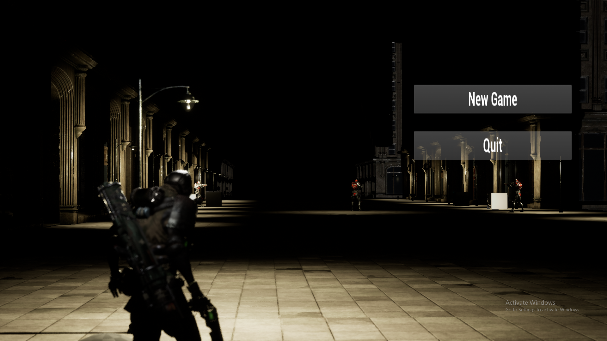
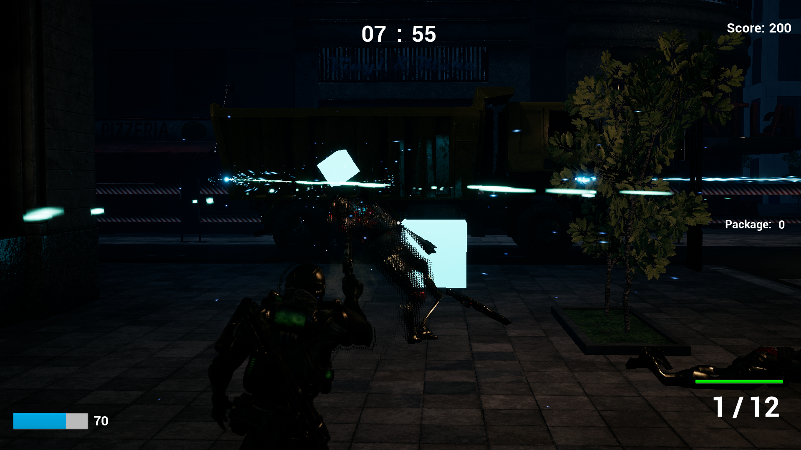
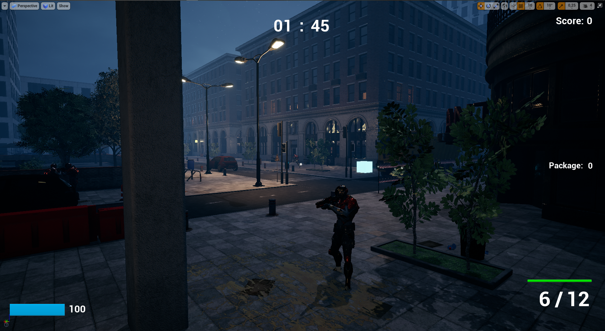
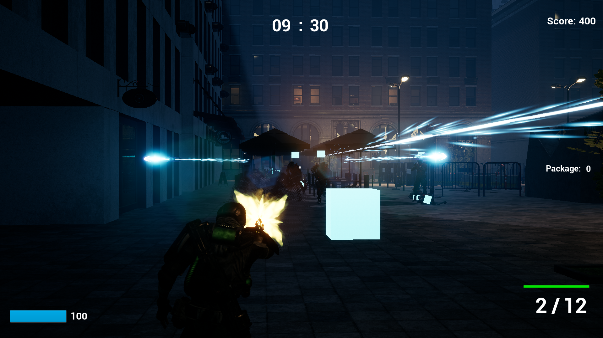
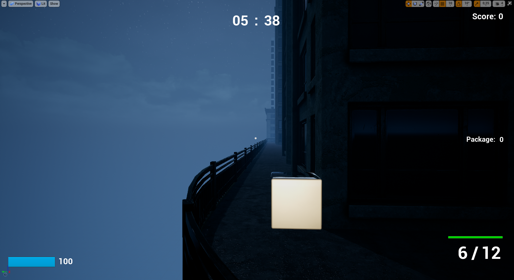
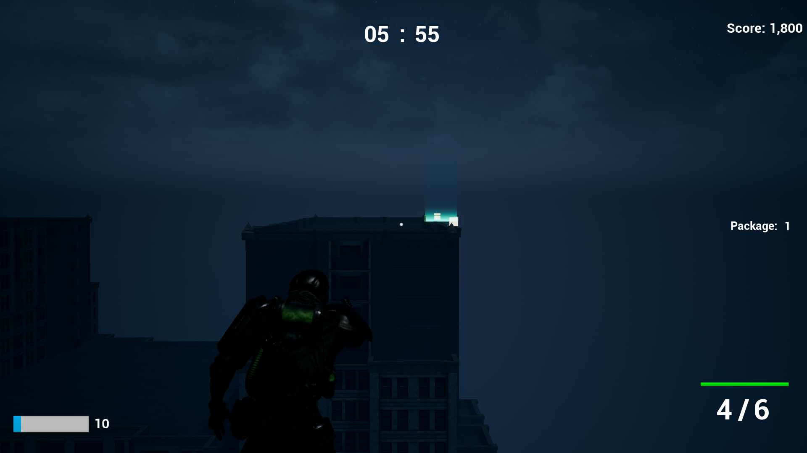
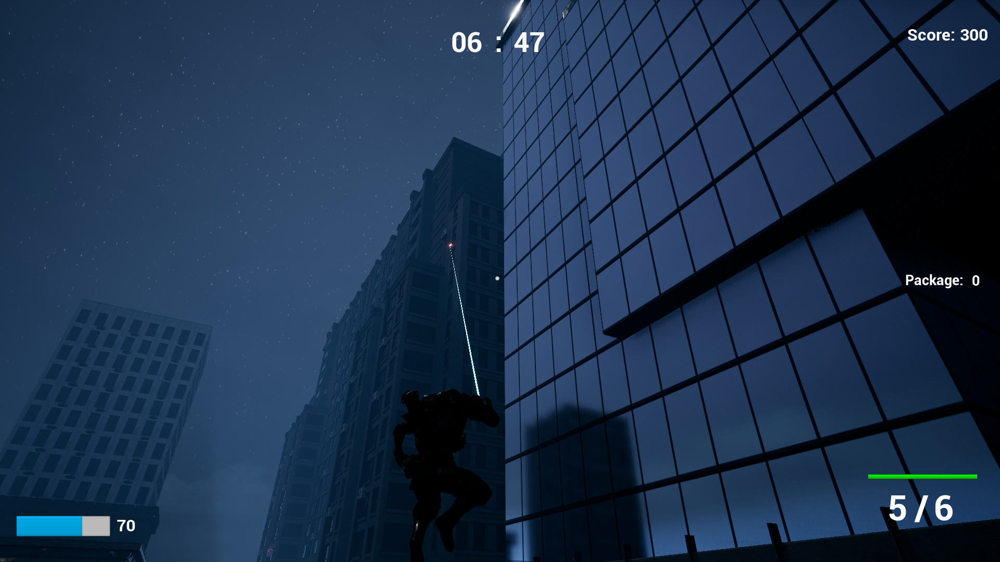

# CityScape

## Overview
CityScape is an adventure game made by 2 computer science students using Unreal Engine 4.

The mission is to locate and acquire various briefcases scattered throughout the city. But be careful, because not all cases you see are real, some of them will blow-up on your face! You have to find the real cases before the time runs out or you will be stuck on the city. Find the briefcases in time and Escape the City.

While your search continues, tough enemies will be looking out for you, be careful about getting caught since their weapons can finish you off real fast. Either destroy them or sneak around.
Using the grappling hook, you can travel around very fast without being seen. But be careful about your launch ability though, it has a cooldown period.

## Screenshots
### Menu Screen

### Enemies

### Package

### Extraction Zone

### Grappling Hook

## Used Assets for Developing
1.	Paragon: Drongo
2.	Paragon: Wraith
3.	Modular Buildings Set
4.	Modern City Downtown with Interiors Megapack (Urban Building / Buildings)

All of these assets can be obtained from Unreal Engine Marketplace
